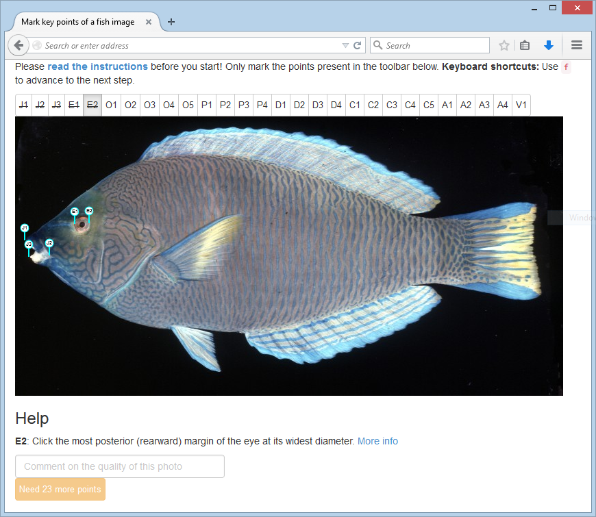

```{r prelude, echo=FALSE, message=FALSE, warning=FALSE}
library("MASS")
library("readr")
library("dplyr")
library("ggplot2")
library("stringr")
library("magrittr")
library("tidyr")
library("reshape2")
library("scales")
library("grid")
library("geomorph")
library("rjson")
library("ipred")
library("vegan")
library("lubridate")
library("directlabels")
library("BAMMtools")
library("knitr")
library("kfigr")
library("knitcitations")
library("fish.reliability")
options("citation_format"="pandoc")
cleanbib()
set.seed(111) # reproducible and stable sampling
data(fish_reliability)
data(fish_families)
knitr::opts_chunk$set(echo=FALSE, cache=1, fig.align="center")
```

<!--
Title page: Provide a concise and informative title (do not include the authorities for any taxonomic names);
            a short running title (45 characters maximum);
            the word count (including references, tables and figure legends);
            a list of all authors' names and addresses;
            and the full contact details of the corresponding author.
-->

# Abstract

<!--
Abstract (maximum 350 words):
Point 1: set the context and purpose for the work;
Point 2: indicate the approach and methods used;
Point 3: outline the main results;
Point 4: identify the conclusions, the wider implications and the relevance to management or policy. 
-->

1. Advances in genomics and informatics have enabled the production of large phylogenetic trees. However, the ability to collect large phenotypic datasets has not kept pace. 

2. Here, we present a method to quickly and accurately gather morphometric data using crowdsourced image-based landmarking. 

3. We find that crowdsourced workers perform similarly to experienced morphologists on the same digitization tasks. We also demonstrate the speed and accuracy of our method on 7 families of ray-finned fishes (Actinopterygii), and find that rates of body shape evolution are correlated with diversification rates.

4. Crowdsourcing will enable the collection of morphological data across vast radiations of organisms, and will facilitate richer inference on the macroevolutionary processes that shape phenotypic diversity across the tree of life.

# Introduction

<!--
Introduction: State the reason for the work, the context and the hypotheses being tested.
-->

XXX: Use r package captioner for captions

Integrating phenotypic data, such as anatomy, behavior, physiology, and other traits, with phylogenies is powerful workflow for investigating the patterns of biological evolution. Recent advances in next-generation sequencing [@Shendure2008; @Meyer2008] and sequence capture technologies [@Faircloth2012b; @Lemmon2012] have made phylogenetic inference of large radiations of organisms possible [@McCormack2012; @McCormack2013; @Faircloth2013; @Faircloth2014].
These large phylogenies have been successfully used in conjunction with existing comprehensive phenotypic datasets to answer key questions about the mode and tempo of diversification and morphological evolution [@Rabosky2013]. However, similar breakthroughs for generating new phenotypic datasets have been comparatively uncommon, likely due to the high expense and effort required [reviewed in @Burleigh2013].

Creating these large phenotypic datasets has generally required an extended dedicated effort of measuring and describing morphological or behavioral traits that are then coded into a comprehensive data matrix. One such example is the Phenoscaping project [<http://kb.phenoscape.org>; @Deans2015], and its complementary efforts in the Vertebrate Taxonomy Ontogeny [@Midford2013] and Hymenoptera Anatomy Ontology [@Yoder2010], which requires large amounts of researcher effort to compile. Other approaches include using machine learning [@Mckinney2013a] or natural language processing [@Cui2012a] to identify or infer phenotypes. These statistical techniques function ideally with either a large training dataset or a complex model [@Brill2003; @Halevy2009; @Hastie2009], both of which also require intensive researcher effort to build and validate. Finally, methods such as high-throughput infrared imaging, mass spectrometry, and chromatography have been successfully used in plant physiology [@Furbank2011]
 and microbiology [@Skelly2013], but these methods may not be applicable for zoological researchers.
These approaches all share a similar goal of collecting large comparative datasets, but also require large investments in researcher effort. This bottleneck has limited the taxonomic breadth and depth of research in comparative biology.

Here we present a method and toolkit to efficiently collect two-dimensional geometric morphometric phenotypic data at a "phylogenomic" scale. 
We developed a novel web browser-based image landmarking application, and use Amazon Mechanical Turk (<https://www.mturk.com>) to distribute digitization tasks to remote workers (hereafter *turkers*) over the Internet, who are paid for their contributions.
We evaluate the accuracy and precision of turkers by assigning identical image sets and digitization protocols to users who are experienced with fish morphology (hereafter *experts*), and compare the inter- and intra-observer differences between turkers and experts.
As an example of how this new method may be used, we construct a phylogenetic analysis pipeline to download photographs and phylogenies of 7 actinopterygiian families from the web, collect Mechanical Turk shape results, and analyze the rate of diversification and body shape evolution using BAMM [@Rabosky2014a].

# Materials and methods

<!--
Materials and methods: Include sufficient details for the work to be repeated.
-->

## Amazon Mechanical Turk

Amazon Mechanical Turk ("MTurk") is a web-based service where Requesters can request work, known as Human Intelligence Tasks ("HITs") to be performed by Workers. Workers work from home and submit the tasks over the Internet, where Requesters review it, and, if they are satisfied with the results, accept the work and pay the Worker. We use MTurk as a platform to distribute our geometric morphometric tasks and financially compensate the worker accordingly. Scientific collection of data over MTurk and similar services has generally been limited to the fields of psychology and computer science, and there have been few attempts to crowdsource biological trait data [but see @Burleigh2013].

## Web-based geometric morphometrics


We developed an application that runs completely on the user's local web browser. This simplifies the infrastructure challenge of needing to serve many crowdsdourced workers simultaneously. The web application is configured with a simple JavaScript Object Notation (JSON) file that describes the landmarks necessary to complete an image digitization task (for more details, see Supplementary Material).

Although digitizing and landmarking a single image [microtasks *sensu* @Good2013] is most effective for high-throughput work on MTurk, it is unsuitable for conducting controlled experiments. To solve this issue we created a server-side application backend that automatically distribute tasks according to a configurable set of images and experimental protocol. This application also mimics an official Amazon Mechanical Turk endpoint, to decouple the experimental backend from the image landmarking frontend. External non-MTurk workers can also participate in the same experiment, ensuring effective comparisons across these groups. The software is open source and uses PHP and SQLite, and can be installed on nearly all web hosting services (<https://github.com/jonchang/fake-mechanical-turk>). 

## Reliability analysis

Collecting landmark-based geometric morphometric data at scale permits detailed analysis of different sources of error, such as among- and within-observer variation [@VonCramon-Taubadel2007]. To assess whether the quality of data gathered by workers recruited through Amazon Mechanical Turk was significantly different than traditionally-collected data, we asked both turkers and experts to landmark a set of 5 fish images, 5 times each. All participants used the same protocol and same software to digitize the same set of fishes.

The landmarks were chosen according to previously-published literature concerning fish shape [@Fink1995; @Cavalcanti1999; @Ruber2001a; @Klingenberg2003; @Chakrabarty2005; @Frederich2008; @Thacker2014], and included landmarks both easy to digitize, such as the anterior margin of the eye, and challenging to digitize, such as the opercular series. We used 5 replicate measurements per worker per image to quantify measurement error within and among observers [@Palmer1986] using *geomorph* `r citep(citation("geomorph"))`.

We used the median shape of the combined experts' data as the "true" shape for all comparisons. To assess the accuracy of worker data, as compared 

To assess the differences between turker and expert data, we compared the median turker position to the median expert position of each landmark. We assumed that the expert median was indeed the true position of that landmark, and calculated the absolute Euclidian distance. Larger distances would indicate low turker accuracy, while smaller distances would indicate high turker accuracy. We also examined the variance in turker landmarks. For each landmark, we rotated the cluster of points and took calculated the median absolute deviation between points along a single dimension. This 

To assess within-individual variation, we compared each worker's shape replicate to their own median shape. To assess within-group and between-group variation, we also compare those individual worker median shapes to the median shape of all other turkers and all other experts. We also used the median absolute deviation (MAD) as a dispersion statistic for within-worker, within-group, and between-group comparisons. This is a statistic robust to outliers

The curse of dimensionality is a common problem in machine learning, where $p$, the number of predictors, greatly exceeds $n$, the number of observations. Geometric morphometric datasets are typically extremely highly dimensional, with $2 * k - 1$ observations per 2D landmark. To reduce the dimensionality of our dataset, we orthogonalize our features used a generalized Procrustes superimposition as implement in the R package geomorph. We then use logistic regression on the PC axes, starting with PC1 and adding each subsequent axis in a stepwise fashion. We validate each model using $K$-fold cross-validation, which splits the data into $K$ equally sized groups, using $K-1$ groups to train the model and the last group to validate the model. This process is repeated for each subset of the groups. We set $K=10$ to validate the model, for its balanced statistical properties [@Kohavi1995; @Hastie2009]. Using 10-fold CV, we calculated the confusion matrix for each model in turn, and plot the sensitivity vs specificify (also known as the receiver operator characteristic curve).  

To reduce the effect of the curse of dimensionality ($p >> n$, where the number of predictors  exceeds the number of observations), we first

<!-- (XXX: Talk about setting the consensus morphologist shape as the "true" shape in terms of determining accuracy / precision of individual workers and the consensus turker shape) -->

To determine whether turkers and experts were statistically distinguishable, we used the machine learning technique linear discriminant analysis [LDA, @Ripley1996] as implemented in *MASS* `r citep(citation("MASS"))`. A common error in assessing the efficacy of machine learning methods is training the model and then testing the model using the same data set for both. The researcher can make the model increasingly sophisticated to better fit the training dataset, but be unable to make accurate inferences to real-world data, due to overfitting. Conversely, withholding too much data for validation results in underfitting and the inability of the model to generalize its predictions to real data. To guard against these potentially misleading inferences, we used $K$-fold cross-validation (CV), which splits our data into $K$ equally-sized groups, using $K-1$ for training and $1$ for validation, and tests the model for all possible permutations of these groups. We used a value of $K=10$ to validate the LDA model, for its balanced approach to the bias-variance tradeoff [@Kohavi1995; @Hastie2009]. Using 10-fold CV, we assessed the LDA model's misprediction rate. Acceptable misprediction rates vary depending upon the application, here we judge 20% misprediction rate to sufficently distinguish turkers and experts, while a 50% or higher rate is no better than a random guess. We also used quadratic discriminant analysis (QDA), to test the robustness of our results with a different model. All analyses were performed in R `r citep(citation())`. (XXX: How to interpret the result of this method. Use R package caret for easier comparisons among different machine learning techniques. Try out support vector machines.)

We calculated the per-digitizer median shape for each image used, as well as the consensus turker and morphologist landmarks, and projected these shapes into Procrustes space. We calculated the 95% confidence ellipse to estimate the uncertainty around these shape estimates. (XXX: How to interpret the result of this method)

## Example: a phenomic pipeline for comparative phylogenetic analysis

A common strategy in fish comparative studies is to examine evolutionary dynamics within a single family (XXX: cite more papers that do this) [@Frederich2013; @Thacker2014], potentially due to the extensive amount of time necessary to collect data.

To demonstrate the utility of obtaining comparative data using this method, we downloaded previously-published phylogenies for 7 fish families (Acanthurdiae, Apogonidae, Balistidae, Chaetodontidae, Labridae, Pomacentridae, and Tetraodontidae) from TreeBASE and Dryad (XXX: CITE TREES -- need to get info from Mike) and matched them to left-lateral images from the Encyclopedia of Life (<http://eol.org/>) using the EOL API [@Parr2014]. If there were multiple images for a single species, we manually selected the best one. Crowdsourced workers collected body shape data following a standard protocol (Supplementary Material). We then determined the major components of shape variation using a Procrustes-aligned principal components analysis (PCA) [@Mardia1979; @Bookstein1991] as implemented in the R package *geomorph* `r citep(citation("geomorph"))`.

To test whether our method can improve on the case where the data collection method is geometric morphometrics, we use the average time it took an expert to measure a single fish image and predict the time it would take for a single individual expert to measure our 7 fish families with 5 replicates, and compare it to the time it actually took turkers to collect these measurements at the same replication level. If the turkers in aggregate annotated images more quickly than a single expert would have, this suggests that the parallelization afforded by crowdsourcing is effective at reducing the time required for data collection. 

We used Bayesian Analysis of Macroevolutionary Mixtures [*BAMM*, @Rabosky2014a] to estimate the diversification rate as well as the rate of morphological evolution, retaining the PC axes whose eigenvalues exceeded the corresponding random broken-stick component [@Jackson1993; @Legendre1998], for each of the 7 families. BAMM estimates the location of rate shifts in either diversification or character evolution using a transdimensional (reversible jump) Markov Chain Monte Carlo method, where the number of rate regimes on a phylogeny is allowed to vary. We assessed convergence and mixing using Tracer [@rambaut2007tracer]. We then used BAMMtools `r citep(citation("BAMMtools"))` to detect whether body shape affects change in the speciation or extinction rate. State-dependent diversification has often been invoked  to explain the high species richness enjoyed by certain lineages [@Mitter1988; @Barraclough1998]; this pipeline demonstrates a largely-automated way to detect these. `r citep(bibentry(bibtype="Article", title="A robust semi-parametric test for detecting trait-dependent diversification", author=c("Daniel L. Rabosky", "Huateng Huang"), year="in.review", journal="Systematic Biology"))`
	
# Results

<!--
State the results, drawing attention to important details in tables and figures
-->

## Reliability analysis


```{r turker_v_expert, fig.cap="Test figure caption", anchor="figure"}
no_st <- fish_reliability %>% filter(role != "student") %>% mutate(role = factor(role))

tmp <- no_st %>% filter(family == "Aca", mark %in% c("A1", "A2"))

accuracy <- no_st %>% group_by(family, mark) %>% summarise(median = dist_2d(x, y, role)) %>% group_by(family) %>% mutate(outlier=upper_outlier(median, extreme = 2))

precision <- no_st %>% group_by(role, family, mark) %>% summarise(var = mad_2d(x, y)) %>% spread(role, var) %>% group_by(family, mark) %>% transmute(mad = log(turker / morphologist))


full_family <- data_frame(
  family=c("Aca", "Apo", "Bal", "Cha", "Gob", "Lab", "Pom", "Sco", "Tet"),
  full_family=c("Acanthuridae", "Apogonidae", "Balistidae", "Chaetodontidae", "Gobiidae", "Labridae", "Pomacentridae", "Scorpaenidae", "Tetraodontidae")
)

all_stats <- left_join(accuracy, precision) %>% left_join(full_family) %>% mutate(outlier_label = ifelse(outlier, as.character(mark), NA))

ggplot(all_stats, aes(median, mad, color=outlier)) + geom_point() + labs(x="Accuracy", y="Precision: log2 turker variance / expert variance ") + facet_wrap(~full_family)# + geom_dl(aes(label=outlier_label), size=1, list("top.bumptwice", dl.trans(y=y+0.1), cex=0.75)) + scale_color_manual(values=c("black", "red")) + ylim(-max(abs(all_stats$mad) + 0.25), max(abs(all_stats$mad) + 0.25)) + theme("legend.position" = "none")
```


```{r geomorph_lm, eval=FALSE}
fmted <- format_for_gpagen(no_st)
allsplit <- str_split_fixed(dimnames(fmted)$id, "_", 3)
family_vec <- allsplit[, 1]
role_vec <- allsplit[, 2]
ind_vec <- allsplit[, 3]
gpaed <- gpagen(fmted, ShowPlot=F)

role_by_ind <- procD.lm(gpaed$coords ~ family_vec * role_vec * ind_vec, iter=999, RRPP=T)
ind_only <- procD.lm(gpaed$coords ~ family_vec:ind_vec, iter=999, RRPP=T)


advanced.procD.lm(gpaed$coords ~ ind_vec,  ~ role_vec * ind_vec, ~ family_vec, iter=499)
```


```{r median_tbl, eval=F, results="asis", anchor="table", fig.cap="Median table"}
med_wide <- meds %>% spread(key=family, value=value)
med_wide %>% knitr::kable(digits = 2, caption = "Median table")
```

```{r mad_tbl, eval=F, results="asis", anchor="table", fig.cap="MAD table"}
mad_wide <- mads %>% spread(key=family, value=value)
mad_wide %>% knitr::kable(digits = 2, caption="MAD table")
```


We compare the difference in accuracy and precision between turkers and experts in Figure `r figr("turker_v_expert")`. 

The most accurate and precise points are those that are related to the position of the eye (landmarks E1 and E2). The least accurate are those in the opercular series (O1-O5), particularly the ones related to the preopercle (O1-O3) as well as in species where the preopercle is difficult to visualize from external morphology alone (e.g., Tetraodontidae). We also plot the median difference and the 


```{r cv_table, results="asis", anchor="table", message=FALSE}

subsamp <- group_by(no_st, family, role) %>% sample_n(size=400) %>% ungroup()

CV <- subsamp %>% group_by(family) %>% do(estimator = errorest(role ~ mark:x + mark:y, data=., model=lda, estimator="cv", est.para = control.errorest(k=10), predict=ip.lda))

CV_sum <- CV %>% summarise(family=family, error=estimator[["error"]]) %>% separate("family", "family", sep="_", extra="drop")

CV <- subsamp %>% group_by(family) %>% do(estimator = errorest(role ~ mark:x + mark:y, data=., model=qda, estimator="cv", est.para = control.errorest(k=10), predict=ip.lda))

CV_sum2 <- CV %>% summarise(family=family, qda_error=estimator[["error"]]) %>% separate("family", "family", sep="_", extra="drop")

CV_sum <- left_join(CV_sum, CV_sum2) %>% left_join(full_family, by="family")

# format for display
CV_sum %>% transmute(`Family`=full_family, `LDA`=error, `QDA`=qda_error) %>% knitr::kable(digits=3, caption="Misprediction rate of linear discriminant analysis (LDA) and quadratic discriminant analysis (QDA) with 10-fold cross validation for each fish image.")
```

Both linear and quadratic discriminant analysis with 10-fold cross validation (Table `r figr("cv_table")`) was unable to reliably distinguish between morphologists and crowdsourced workers using our acceptable misprediction threshold of 20%. 


```{r turk_morph_procrustes_space, fig.cap="Turker morpho space", anchor="figure"}
# Load data from the anonymized results file, remove students, drop bad marks
df <- fish_reliability %>%
	filter(role != "student") %>% 
	separate(col=mark, into=c("cat", "cat_seq"), sep=1, remove=F, convert=T) %>%
	filter(!(family %in% c("Bal") & mark %in% c("D1","D2")), !mark %in% c("O1","O2","O3","O4","O5", "A3", "D3", "D4"))

# grabs the consensus sequence by person and fish
df <- df %>% group_by(family, mark, role, sha1mac) %>% summarise(x=median(x), y=median(y))

coords <- gpagen(format_for_gpagen(df), ShowPlot=F)$coords

plot_tangent_space(pca_df(coords), "PC1", "PC2")
```


Post text 


```{r brokenstick}
# use broken stick method to get the principal components stopping point

pc_res <- prcomp(two.d.array(coords))
eigen_res <- pc_res$sdev^2
bstick_res <- bstick(pc_res)

stopping_pc <- which(eigen_res < bstick_res)[1] %>% as.numeric
```

We analyzed PC 1 through PC `r stopping_pc`, based on the broken-stick method of determining a PCA stopping point. Projecting consensus shapes into Procrustes space (Figure `r figr("turk_morph_procrustes_space")`) shows that within-group variation exceeds that of among group variation. The consensus turker shape and consensus expert shape are nearly identical for 5 of 7 families on PC1 and PC6 (Figure `r figr("turk_morph_procrustes_space")`, S1 and S2). 

## Phenomic pipeline for comparative phylogenetic analysis

XXX: Include BAMM speciation / morphological evolution analysis. 


```{r sevenfamily_tangent_plot, message=F, warning=F, fig.show="hold", fig.cap="Family figures", anchor="figure"}
df <- fish_families %>% group_by(tip, mark, family) %>% summarise(x=median(x), y=median(y))

splut <- gather(df, variable, val, x:y) %>% unite(id, family, tip, sep="|")

res <- xtabs(val ~ mark + variable + id, data=splut)

groups <- str_match(dimnames(res)$id, "(.*)\\|")[, 2] %>% factor %>% as.numeric

full_coords <- gpagen(res, ShowPlot=F)$coords

pcaed <- pca_df(full_coords) %>% separate(id, into=c("family", "name"), sep="\\|", extra="drop")

pcaed %>% select(name, PC1) %>% write.table(file="lol.txt", quote=F, row.names=F, col.names=F, sep="\t")

plot_tangent_space2(pcaed, labelmethod=list("chull.grid"))
```


asdfsdf


```{r timing_plot, fig.cap="Line plot showing time to receive results for any given image (x axis) and the total fraction of the data set received (y axis). Landmarks were first received 8 minutes after creation of the Amazon MTurk task, and at least one replicate was received for every image at the 80 minute mark.", anchor="figure"}
# median time (in minutes) it takes an expert to measure these fishes
timings <- (no_st %>% group_by(role) %>% summarise(duration=median(duration))) %>% mutate(total_time=duration * nrow(no_st))

morpho_per_image <- timings[1, 2] %>% as.numeric() %>% dminutes() %>% round(1)

# data collection time plot
timing_data <- fish_families %>% ungroup() %>% group_by(tip) %>% summarise(time=min(time_taken)) %>% arrange(time) %>% mutate(frac=1:n()/n())

ggplot(timing_data, aes(time, frac)) + geom_line() + labs(x="Time taken (in minutes) to receive data for one unique replicate", y="Fraction of image set complete") + theme_minimal() + xlim(0, NA)

total_turker_time <- max(fish_families$time_taken) %>% as.numeric %>% dminutes %>% round(1)
```


Using a median-expert time of `r as.character(morpho_per_image)` per image, we estimate that a single morphologist would take `r as.character(morpho_per_image * nrow(no_st))` to landmark all `r nrow(no_st)` images. At 5x replication, this would take `r as.character(morpho_per_image * nrow(no_st) * 5)`. By comparison, turkers took a total of `r as.character(total_turker_time)` to complete all images at 5x replication.

The BAMMtools analysis identified areas of each phylogeny that were experiencing faster rates of body shape evolution. XXX: Talk about these in more detail.

# Discussion

<!--
Point out the importance of the results and place them in the context of previous studies and in relation to the application of the work (expanding on the Synthesis and applications section of the Summary). Where appropriate, set out recommendations for management or policy.
-->

XXX: Discuss what people currently do to estimate error in geometric morphometrics. Make the point that this method is really good at getting at an estimate of error.

We found that for certain landmarks there was significant between and within group disagreement. Based on median average deviation, points belonging to the opercular series and those that concerned the distal margin of the dorsal and anal fins were particularly challenging for turkers to digitize, compared to the experts. Typically, geometric morphometric studies only use a single digitizer in efforts to reduce interdigitizer error. We argue that this common technique is flawed, as it papers over potential differences in how observers measure the same homologous landmark on the same organism. Instead, explicitly accounting for interobsever error is critical to determine the efficacy of each individual landmark and the replicability of the study as a whole. Examining interobserver error is a critical process that signals which landmarks can be relied on and which can be discarded, as we have done in this analysis. Despite the reduction in the amounts of landmark data collected, even a simplified protocol can produce meaningful biological results that are concordant with previous hypotheses in these groups.

Previous work in generating large phenotypic datasets typically relied on one or more of expertise, effort, and computational power.
Collecting phenotypic data remains a large bottleneck in our ability to comprehensively test hypotheses about large radiations of organisms. We developed a method to gather phenotypic data using Amazon Mechanical Turk.
Our results show that the quality of turkers' data are not significantly different from results collected from experts, and that these data can be gathered extremely quickly.

We attempted to distinguish between turker-generated landmarks and expert-generated landmarks using linear discriminant analysis. Even the image with the lowest misprediction rate, from the family `r filter(CV_sum, min(error) == error)$family`, still incorrectly predicted the digitizer's identity `r filter(CV_sum, min(error) == error)$error %>% as.numeric() %>% scales::percent()` of the time, suggesting that, given a set of landmarks, it is difficult to predict whether a turker or a morphologist created them. The quadratic discriminant analysis did not reliably improve prediction of worker identity over the LDA.

The traditional way of collecting phenotypic data involves enormous researcher effort and significant morphological expertise. For example, @Brusatte2014 used a 853 character discrete character matrix for 150 taxa to estimate the rate of morphological evolution in the transition from theropod dinosaurs to modern birds. These data were collected over the course of 20 years as part of the Therapod Working Group [@Norell2001; @Clark2002; @Hwang2002; @Hwang2004; @Makovicky2005; @Norell2006; @Turner2007; @Turner2012; @dryad_84t75]. @OLeary2013 combined the work of MorphoBank contributors [@OLeary2011] with literature review to generate 4,541 characters for 86 species. @Rabosky2013 examined 7,822 species of ray-finned fish but used a single quantitative measure (body size) to evaluate correlated speciation and morphological evolution. Newer approaches, typically involving statistical techniques such as machine vision or natural language processing, still require significant researcher expertise in either gathering large training datasets, or to develop new and more sophisticated machine learning models [@Brill2003; @Halevy2009].

Our novel pipeline to download images, upload them to Amazon MTurk, and process them using BAMM and BAMMtools showcases the ability to rapidly collect phenotypic data. Most of the time taken to collect these data were spent on waiting for worker results; however, a majority of the data had already been collected at the 1-hour mark. An online methodology could conceivably improve on this analysis time, by iteratively refining its results as new data streamed in from Amazon's servers. (BAMM does not support adding new data mid-analysis). Other speedups could be found, particularly in identifying the best image for each species to use for analysis. This could easily be replaced with a protocol for image selection and uploaded to MTurk for categorization.

The results of this pipeline also serve to test previous predictions of the rates of cladogenic speciation and mophological evolution [@Rabosky2013]. Body shape and body size are usually correlated (XXX: find the Cite), and the first PC axis of body shape analyses is typically associated with features related to size. (XXX: make an extensive comparision between the results of the nat comm paper and the 7 families here)

Our approach hits a "sweet spot" on the three axes of expertise, effort, and computational complexity. We use researcher expertise to identify a comparative hypothesis, and design a data collection protocol to specifically test this hypothesis. Users on Amazon Mechanical Turk supply a large source of worker effort that collects data per our protocol. Finally, computational statistical techniques validate the accuracy of our data and identify outliers and other errors in data collection. Researchers do not have to spend time digitizing collections, workers need not generate biological hypotheses, and biologists will not have to solve open questions in the fields of machine vision and natural language processing in order to answer questions in comparative biology. The task of phenomic-scale data collection is split up and efficiently allocated according to the strengths of each role, without overly relying on any one axis to carry out the entire task.

We stress that our work does not attempt to, and will likely never displace traditional morphological research and data collection. The role of these traditional techinques is critical for generating preliminary hypotheses. Our method instead performs high-throughput collection of phenotypic data to match the current speeds of molecular data collection. Collecting this data is not useful without having in mind a specific hypothesis to test. Our work fills the niche of gathering phenotypic data across large radiations, which is still a challenging open research question. Even seemingly obvious phenotypes, such as the woodiness of plant species, are incomplete and sampled in a biased manner, potentially misleading inference on a global scale [@FitzJohn2014]. We suggest that our method can play a crucial role in increasing the amount of data that can be brought to bear against comparative hypotheses.

# Acknowledgements

We thank XXX, YYY, and ZZZ for helpful comments on the manuscript, as well as Tina Marcroft, Bruno Frédérich, Vanson Liu, Rosalia Aguilar, Ryan Ellingson, Francesco Pickens, Colette LaRochelle, and the `r (fish_reliability %>% filter(role == "turker") %>% distinct(sha1mac) %>% nrow()) + (fish_families %>% select(worker) %>% distinct() %>% nrow()) ` Amazon Mechanical Turk workers that contributed their time and effort. We also thank Dan Rabosky, Brian Sidlauskas, Matthew McGee, Adam Summers, and Michael Burns for insightful discussions about fish morphology and digitization protocols. Katie Staab, Tonya Kane, and their `r fish_reliability %>% filter(role == "student") %>% distinct(sha1mac) %>% nrow()` undergraduate students served as beta testers for the methods in this study. This work was supported by an Encyclopedia of Life David M. Rubenstein Fellowship (EOL-33066-13), a Stephen and Ruth Wainwright Fellowship, and a UCLA Research and Conference Award to JC. (XXX: Mike's grants?). Travel support to present this research was also provided by the Society for Study of Evolution to JC.

## Author contributions

Conceived and designed the experiments: JC MEA. Performed the experiments: JC. Analyzed the data: JC. Contributed reagents/materials/analysis tools: JC MEA. Wrote the paper: JC MEA.


## Supplementary material

<!-- reset figure numbering for supplement -->

\renewcommand\thefigure{S\arabic{figure}}
\setcounter{figure}{0}

```{r}
knitr::opts_chunk$set(fig.cur=1)
```

Below is an example JSON file that demonstrates the utility of our web app:

```json
{
    "C": {
        "kind": "point",
        "help": "Click the center of the eye."
    },
    "D": {
        "kind": "line",
        "help": "Click and drag from the left edge of the eye
                 to the right edge of the eye."
    },
    "O": {
        "kind": "curve",
        "help": "Click and drag over the outline of the eye,
                 starting from the leftmost point of the eye."
    }
}
```

Each digitization task to be completed is given a short abbreviation to aid task identification ("C" for center, "D" for diameter, and "O" for outline), and the type of task, "point", "line" or "curve", for homologous landmarks, linear measurements, and sliding semilandmarks can be specified. There is also an optional short help snippet displayed inline, which serve as a brief reminder for each landmark and complements a larger and more detailed protocol document that workers are required to read before beginning work.




```{r turker_morph_procrustes_other_pc23, message=FALSE, warning=FALSE, fig.cap="PC2 and PC3 for turker / morphologist Procrustes space"}
coords_df <- pca_df(coords)
plot_tangent_space(coords_df, "PC2", "PC3")
```

```{r turker_morph_procrustes_other_pc34, message=FALSE, warning=FALSE, fig.cap="PC3 and PC4 for turker / morphologist Procrustes space"}
plot_tangent_space(coords_df, "PC3", "PC4")
```

```{r turker_morph_procrustes_other_pc45, message=FALSE, warning=FALSE, fig.cap="PC4 and PC5 for turker / morphologist Procrustes space"}
plot_tangent_space(coords_df, "PC4", "PC5")
```

<!-- spit out all figures before references -->
\clearpage

# References

```{r knitcitations_write, message=FALSE}
write.bibtex(file="knitcitations.bib")
# Also download Mendeley bibliography
mendbib <- RCurl::getURL("https://www.dropbox.com/s/ehwm3c945k7rh0n/library.bib?dl=1", .opts=RCurl::curlOptions(followlocation=TRUE))
cat(mendbib, file="library.bib")
```

